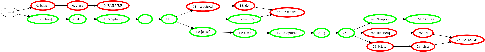

    #include <gllpp/Gllpp.h>
    #include <iostream>
    
    Parser grammar;

	auto function = "def"_t + Capture<'{'>() + "{"_t + "}"_t;
	function.set_name("[function]");

	auto cls = "struct"_t + Capture<'{'>() + "{"_t + "}"_t;
	cls.set_name("[class]");

	auto topLevelDefinition = function | cls;

	grammar = SetLayout(topLevelDefinition + Optional(grammar), " \t\r\n");

	auto code = "def test {}\n"
		"struct cls {}";
	auto parseResults = grammar.parse_entry(code);
	for (auto& parseResult : parseResults) {
		std::cout << parseResult.type << " '" << parseResult.trail << "'" << std::endl;
	}

